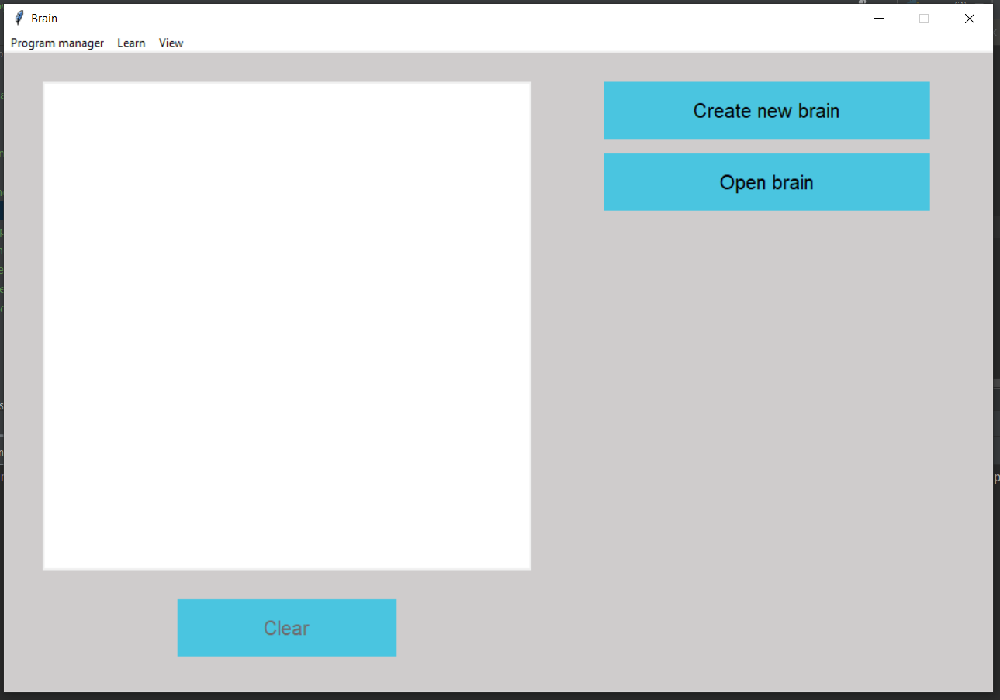
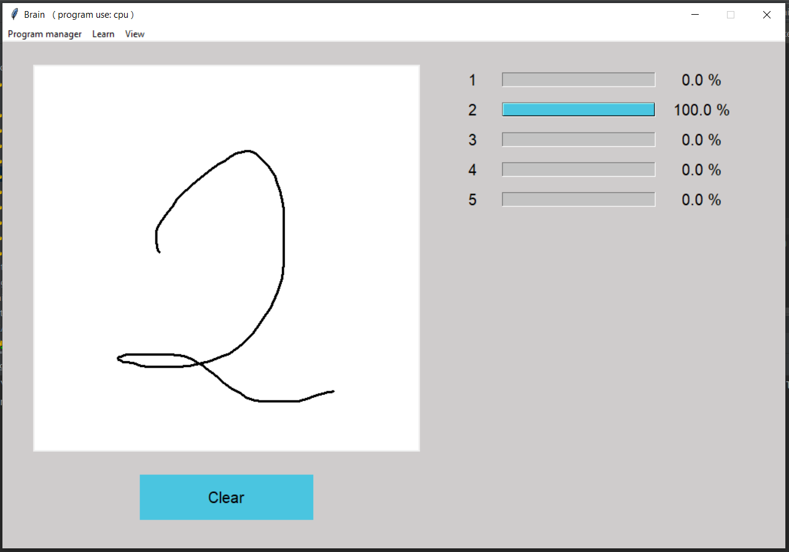
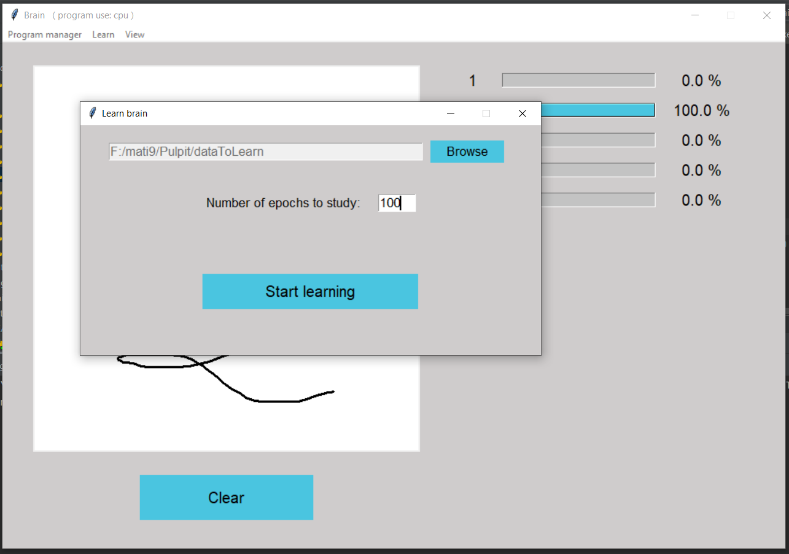
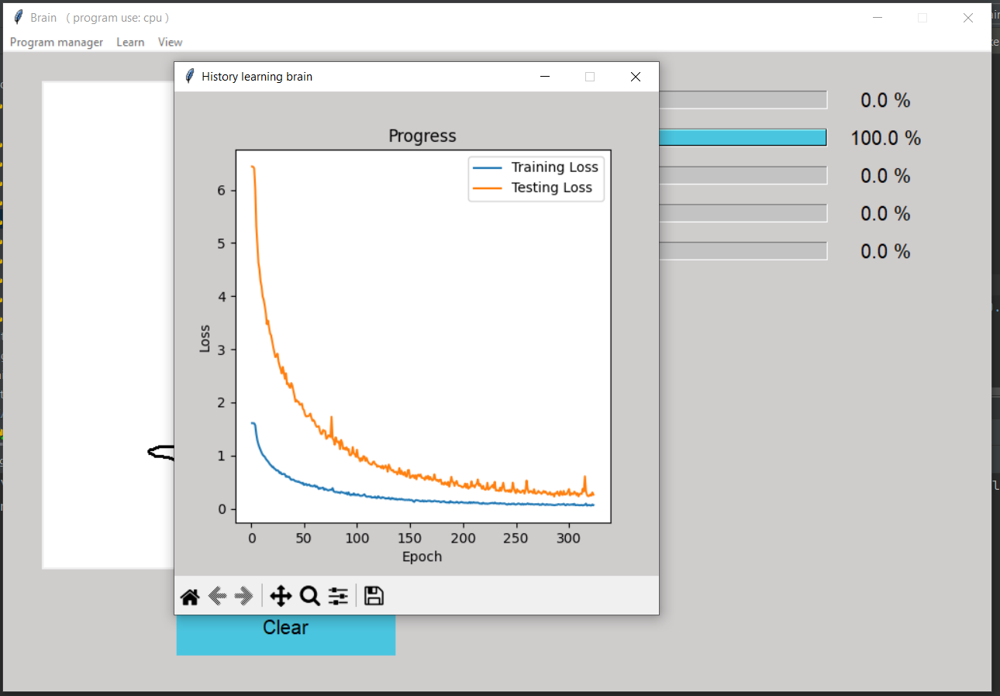

#  Brain
This project is a graphical application built using Tkinter in Python. Its main functionality revolves around utilizing Convolutional Neural Networks (CNNs) to recognize and predict handwritten symbols or signs. The application provides a user-friendly interface for drawing symbols, training a CNN on a dataset, and visualizing the learning process.

## Content
* Application Code
* Handwritten Digits Dataset (1-5) with 3500 images
* Trained CNN Model for the provided dataset

## Design applictaion





## Installation
To use this package, you need to install the following dependencies:

* Python 3.7 or higher (I use Python 3.11)
* PyTorch
* Tkinter
* Threading
* PIL
* matplotlib
* os

## Usage
To launch this project

```python
  python main.py
```